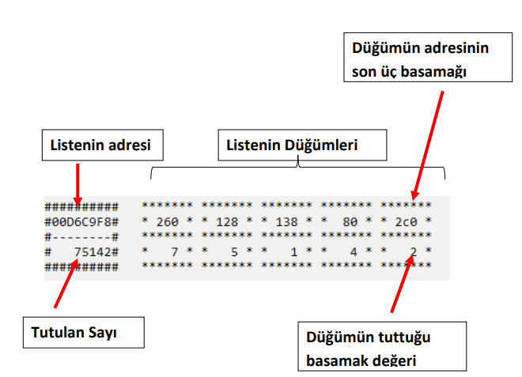

1. Ödev [Tüm Şubeler İçin]
Teslim Tarihi
26 Kasım 2023 (Pazar günü saat 23:50’ye kadar.)
Ödev İçeriği
MinGW C++ ortamında derlenen bir program yazılacaktır.
Bu ödevde tek yönlü bağlı listeler kullanarak tam sayılar üzerinde çeşitli işlemler yapılması 
istenmektedir.
Uygulamanız Sayilar.txt dosyası içerisindeki tam sayıları okuyacaktır. Aşağıda bu dosyaya bir örnek 
verilmiştir (Dosya içerisindeki sayı adedi değişebilir). Sayılar arasında tek bir boşluk bulunacaktır.

Şekil 1. Sayilar.txt dosyasının örnek içeriği
Her bir sayı bir bağlı listede tutulacaktır. Okunan sayının basamakları listenin düğümleri olacaktır.
Aşağıda 75142 sayısının bir bağlı liste içerisindeki düğümlerle temsil edilmesi gösterilmektedir.
• Her bir basamağın tutulacağı düğüm sınıfı Basamak isminde olacaktır.
• Basamakları bir arada tutacak olan liste sınıfının ismi Sayi olacaktır
75142

Şekil 2. Sayi listesinin içeriği

Şekil 3. Basamak düğümünün içeriği 
7 5 1 4 2
NULL ilk
Basamak Değeri
Sonraki düğümün 
adresi
Basamak
Sayi
Aşağıda geliştireceğiniz uygulamanın örnek bir ekran çıktısı verilmiştir. Ekran çıktısında ilk olarak her 
bir sayısı temsil eden liste ve düğümleri yatay olarak aşağıdaki gibi ekrana çıkartılacaktır. Bütün sayı 
listeleri ekrana çıkartıldıktan sonra programın kontrol menüsü ekrana çıkartılmalıdır. Buradaki menü 
kullanıcıdan seçim istemektedir.

Şekil 4. Uygulamanın örnek ekran çıktısı
Listelerin ekran Çıktısı
Program kontrol Menüsü
Aşağıda 75142 sayısını temsil eden listenin ekran çıktısı gösterilmektedir.

Şekil 5. Sayi listesinin ekrana çıkartılması
Sayi listelerini tutmak için SayilarListesi isimli bir bağlı liste sınıfı tasarlanacaktır. Bu listenin her bir 
düğümünde bir Sayi listesi barındırılacaktır. SayilarListesi listesinin düğümleri içinde Dugum isimli bir 
sınıf tasarlanması gerekmektedir. Bu sınıfın barındıracağı elemanların içeriği Şekil 7’de verilmiştir.

Şekil 6. SayilarListesi listesinin içeriği

Şekil 7. Dugum nesnelerinin içeriği
Listenin adresi
Tutulan Sayı
Listenin Düğümleri
Düğümün adresinin 
son üç basamağı
Düğümün tuttuğu 
basamak değeri
Sayi* Sayi* Sayi* Sayi* Sayi*
NULL ilk
Sayi nesnesi 
gösteren işaretçi
Sonraki düğümün 
adresi
Dugum
Uygulama çalıştığında Şekil 4’te gösterildiği gibi ekran çıktısı elde edilmelidir. Kullanıcı 1 değerini 
seçtiğinde her bir Sayi listesindeki basamak düğümlerinin tek değer tutanları listenin başına 
taşınmalıdır. Aşağıdaki şekilde bu işleme bir örnek göstermektedir. Tek olan düğümler listenin başına 
taşınmıştır. Eğer dikkat edecek olursanız taşınan düğümünün adresi değişmemiştir. Yani 
düğümlerinin değerlerinin değiştirilmesi kabul edilmeyecektir. Düğümlerin listede konum 
değiştirmesi gerekmektedir.

Şekil 8. Tek basamakların başa çekilmesi.
Kullanıcı 2.seçeneği seçtiğinde Sayıların basamak düğümleri sondan başa gelecek şekilde yer 
değiştirmelidir. Bir önceki seçenekte olduğu gibi düğümlerin verilerini değiştirmek yeterli değildir. 
Düğümlerin listedeki konumu değişmelidir. Bu işlem Şekil 9’da gösterilmektedir. Düğümlerin 
adreslerine dikkat edecek olursanız listedeki konumları değişse de hafızadaki konumları 
değişmemektedir.

Şekil 9. Basamakların terslenmesi
Son olarak kullanıcı 3. Seçeneği seçerse SayilarListesi içerisindeki en büyük Sayi listeden 
çıkartılmalıdır.
Uygulama Videosu
Seçimden önce
Seçimden sonra
Seçimden önce
Seçimden sonra
Çok büyük dosyaları okuyabilecek şekilde program yazılmalıdır. Programda çöp oluşması puan 
kırılmasına neden olur.
Hiçbir şekilde Şablon (Generic) veri yapısı kullanılamaz. Her sınıfın başlık ve kaynak dosyası 
ayrı olmalı ve başlık dosyasında metot gövdesi bulunmamalıdır. Hazır veri yapısı 
kullanılamaz.
Önemli Not: Raporunuz detaylı olmalı ve kendi cümleleriniz olmalıdır. Kopya ödevler sıfır 
olarak değerlendirilecektir. SABİS şifreniz sizin sorumluluğunuz altındadır eğer arkadaşınız 
sizden habersiz ödevinizi alırsa bundan sizde sorumlu tutulur ve sıfır alırsınız.
Teslim Formatı
Klasör Hiyerarşisi
o src Klasörü (Kaynak dosyalarınızın bulunduğu klasör)
o lib Klasörü (.o dosyalarının bulunduğu klasör)
o include Klasörü (Başlık dosyalarınızın bulunduğu klasör)
o doc Klasörü (Raporunuzun bulunduğu klasör.)
o bin Klasörü (Çalıştırılabilir dosyalarınızın (.exe) bulunduğu klasör.)
o benioku.txt (Program için ayrıca belirtmek istedikleriniz. Önerileriniz. Boş kalabilir.)
o makefile 
makefile olmayan ödev derlenmemiş olarak kabul edilmektedir. (-50 puan)
Rapor Yoksa veya yetersiz ise (-15 Puan)

Rapor pdf formatında olmalıdır. Raporu ayrıca çıktı olarak getirmenize gerek yoktur. Raporunuzda 
kısaca sizden istenilen, öğrendikleriniz, ödevde yaptıklarınız, eksik bıraktığınız yerler, zorlandığınız 
kısımlar anlatılabilir. Ödev raporunda yazı boyutu 12 puntodan büyük olamaz ve en az 1 sayfa en 
çok 2 sayfa olabilir.
Klasörlerinizi bir ana klasör içine koyarak .rar veya zip’leyip SABİS üzerinden gönderiniz. Ana 
klasörünüzün adı sadece sizin öğrenci numaranız (örn: B111210090) olmalıdır. Yukarıda belirtilen 
teslim tarihinden sonra gönderilen ödev kesinlikle kabul edilmeyecektir.
Önemli: SABİS üzerinden bir ödev için dosya gönderme hakkınız 3 seferdir. Hoca ekranında en 
son yüklediğiniz dosya görünür.
Yazmış olduğunuz bütün kaynak kodların en başında aşağıdaki bilgiler bulunmalıdır. Bilgileri kendinize 
göre güncelleyiniz.
/** 
* @file Dosya adı
* @description Programınızın açıklaması ne yaptığına dair.
* @course Dersi aldığınız eğitim türü ve grup
* @assignment Kaçıncı ödev olduğu
* @date Kodu oluşturduğunuz Tarih
* @author Gruptakilerin yazar adları ve mail adresleri
*/
Önemli: Yazacağınız kodlar MinGW derleyicisinde kesinlikle derlenmelidir. Derlenmeyen kod itibar 
görmez ve çok düşük puan üzerinden değerlendirilir. Sadece C++ kodları kullanılmalıdır. 
Ödev Bireyseldir
KOPYA ÖDEV SIFIR OLARAK DEĞERLENDİRİLMEKTEDİR*
* Şubeler farklı dahi olsa kopya ödev gönderenler sıfır olarak değerlendirilecektir.